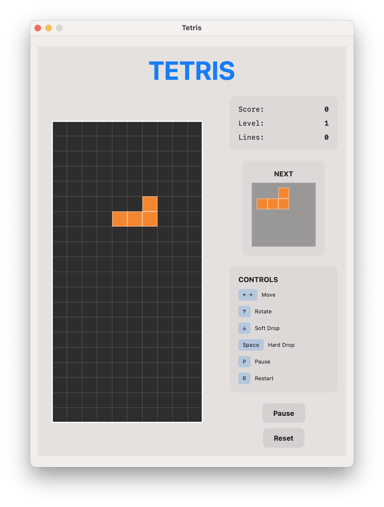

# Tetris for macOS

A classic Tetris game built with Swift and SwiftUI for macOS.



## Features

- **All 7 classic Tetromino shapes** (I, O, T, S, Z, J, L) with traditional colors
- **Standard 10×20 game board** with 4 hidden rows for spawn/rotation space
- **Complete game logic** including collision detection, line clearing, and scoring
- **SwiftUI-based interface** with responsive controls and visual feedback
- **Keyboard controls** following classic Tetris conventions
- **Original Tetris scoring system** (40/100/300/1200 points for 1/2/3/4 lines)
- **Level progression** with increasing speed every 10 lines cleared
- **Super Rotation System (SRS)** wall kicks for better rotation handling

## Requirements

- macOS 13.0 or later
- Swift 5.9 or later

## Installation

### Building from Source

1. Clone the repository:
   ```bash
   git clone https://github.com/sleetdrop/tetris.git
   cd tetris
   ```

2. Build the project:
   ```bash
   swift build -c release
   ```

3. Create the app bundle:
   ```bash
   ./build-app.sh
   ```

4. Run the game:
   ```bash
   open Tetris.app
   ```

Or run directly:
   ```bash
   swift run
   ```

## Controls

| Key | Action |
|-----|--------|
| **← →** | Move piece left/right |
| **↑** | Rotate piece (with wall kicks) |
| **↓** | Soft drop |
| **Space** | Hard drop (instant drop to bottom) |
| **P** | Pause/Resume game |
| **R** | Reset game |

## Game Features

### Scoring System
- 1 line: 40 × level
- 2 lines: 100 × level
- 3 lines: 300 × level
- 4 lines (Tetris): 1200 × level

### Level System
- Level increases every 10 lines cleared
- Game speed increases with each level
- Starting level: 1

### Game States
- **Ready**: Game initialized, ready to start
- **Playing**: Game in progress
- **Paused**: Game paused
- **Game Over**: Game ended (press R to reset)

## Project Structure

```
Tetris/
├── Sources/
│   ├── Models/
│   │   ├── Tetromino.swift      # Tetromino shapes and rotation logic
│   │   └── GameBoard.swift      # Game board and collision detection
│   ├── Game/
│   │   └── GameController.swift # Game logic, state management, timing
│   ├── Views/
│   │   ├── ContentView.swift    # Main game interface
│   │   ├── GameBoardView.swift  # Game board rendering
│   │   └── NextPieceView.swift  # Next piece preview
│   └── TetrisApp.swift          # App entry point
├── Package.swift                # Swift package configuration
├── build-app.sh                 # App bundle build script
├── Info.plist                   # macOS app configuration
├── LICENSE                      # BSD 3-Clause License
└── README.md                    # This file
```

## Technical Details

### Architecture
- **MVVM Pattern**: SwiftUI views with ObservableObject view models
- **Main Actor**: Thread-safe UI updates with `@MainActor`
- **Timer-based Game Loop**: 60 FPS update rate with proper thread safety

### Key Components

1. **Tetromino Model** (`Tetromino.swift`)
   - All 7 tetromino shapes with rotation matrices
   - Color definitions for each shape
   - Rotation logic with 90-degree increments

2. **Game Board** (`GameBoard.swift`)
   - 10×20 visible grid with 4 hidden rows
   - Collision detection with bounds checking
   - Line clearing with array safety checks

3. **Game Controller** (`GameController.swift`)
   - Game state management (ready, playing, paused, game over)
   - Scoring and level progression
   - Timer-based piece falling
   - Input handling for movement and rotation

4. **SwiftUI Views**
   - Responsive game board rendering
   - Score and next piece display
   - Game state controls

## Development

### Building and Testing
```bash
# Debug build
swift build

# Release build
swift build -c release

# Run tests (if any)
swift test
```

### Creating App Bundle
The `build-app.sh` script creates a proper macOS `.app` bundle:
```bash
chmod +x build-app.sh
./build-app.sh
open Tetris.app
```

## License

This project is licensed under the BSD 3-Clause License - see the [LICENSE](LICENSE) file for details.

## Author

**Yuan** - sleetdrop@gmail.com

- GitHub: [@sleetdrop](https://github.com/sleetdrop)

## Acknowledgments

- Inspired by the original Tetris game created by Alexey Pajitnov
- Built with Swift and SwiftUI for modern macOS development
- Uses standard Super Rotation System (SRS) for piece rotation